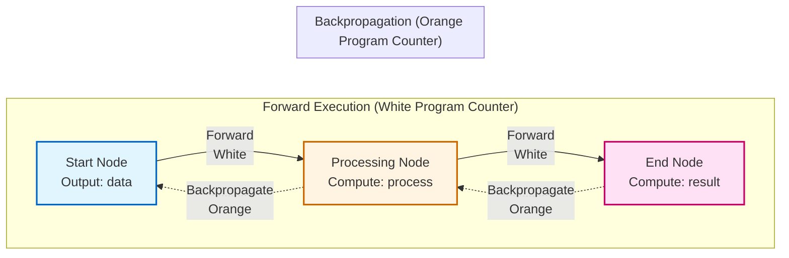
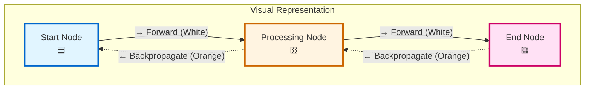
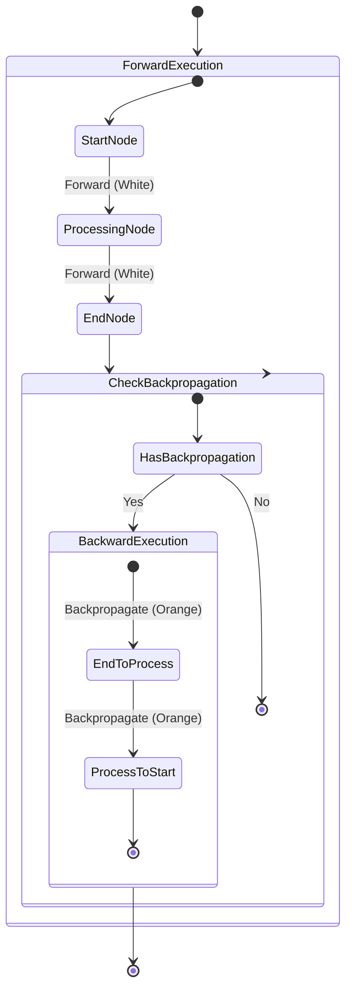
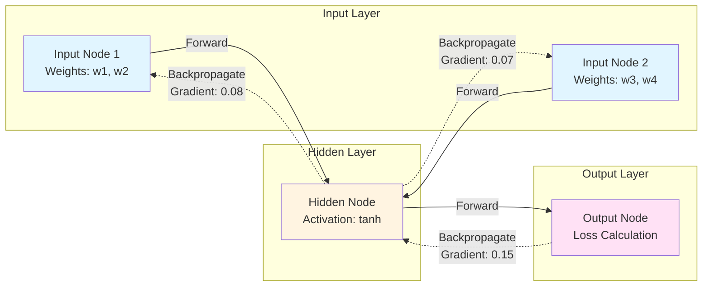

# Backpropagation Flow Diagram

This diagram illustrates how backpropagation works in the flow execution system, showing both forward execution and backward propagation of data.

## Flow Execution with Backpropagation



## Detailed Backpropagation Flow

```mermaid
sequenceDiagram
    participant Start as Start Node
    participant Process as Processing Node
    participant End as End Node
    
    Note over Start,End: Forward Execution (White Program Counter)
    Start->>Process: Execute compute()<br/>Output: data
    Process->>End: Execute compute()<br/>Output: result
    
    Note over End,Start: Backpropagation (Orange Program Counter)
    End->>End: Return {<br/>  result: value,<br/>  backpropagate: feedbackData<br/>}
    End->>Process: backpropagate(feedbackData)
    Process->>Process: Update internal state<br/>with feedbackData
    Process->>Start: backpropagate(processedFeedback)
    Start->>Start: Update internal state<br/>with processedFeedback
```

## Node Connection Visualization



## Complete Execution Cycle



## Example: Neural Network Layer



## Key Concepts

1. **Forward Execution**: Normal flow execution with white program counter moving from start to end nodes
2. **Backpropagation**: Reverse flow with orange program counter moving from end to start nodes
3. **Data Flow**: 
   - Forward: Output data flows from source to destination
   - Backward: Feedback/gradient data flows from destination to source
4. **Visual Indicators**:
   - White cursor = Forward execution
   - Orange cursor = Backpropagation
   - No message bubble for backpropagation (only program counter)

